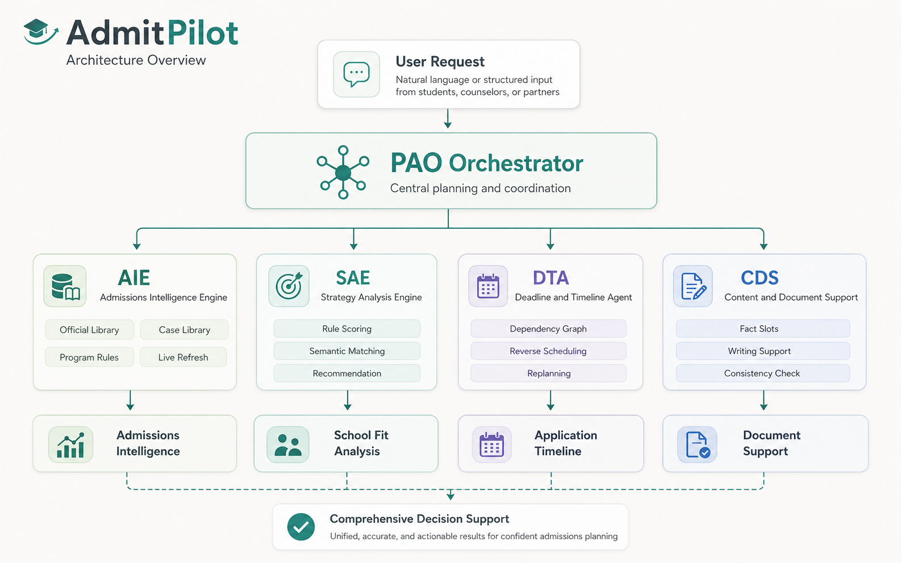
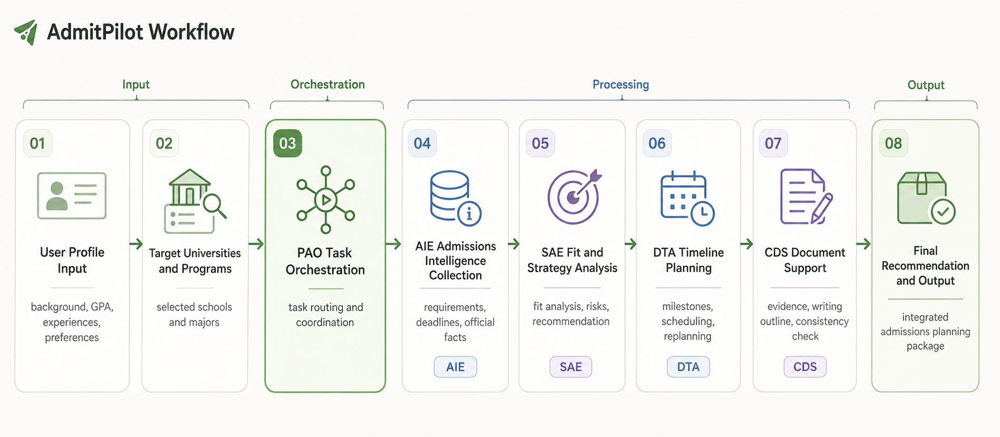
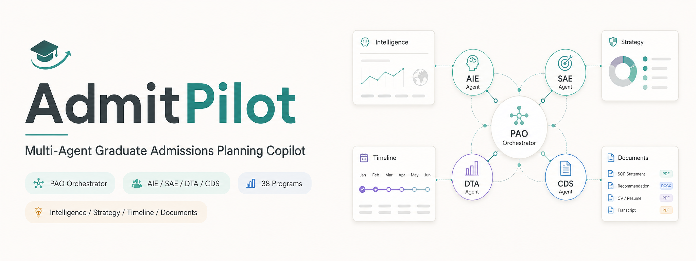
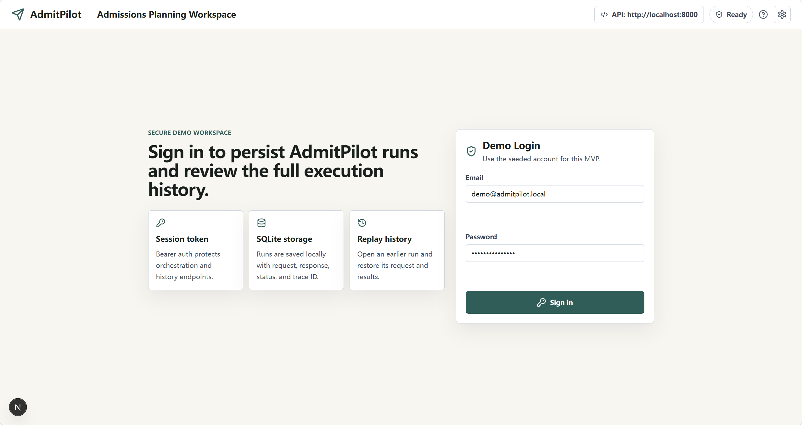
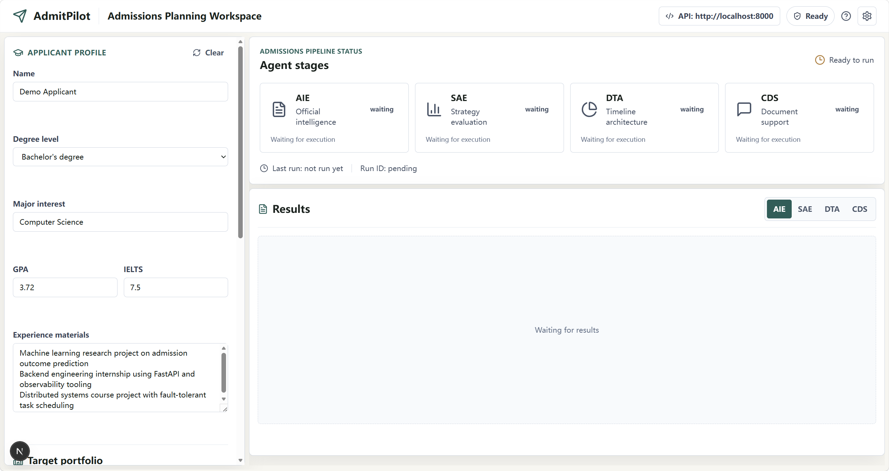
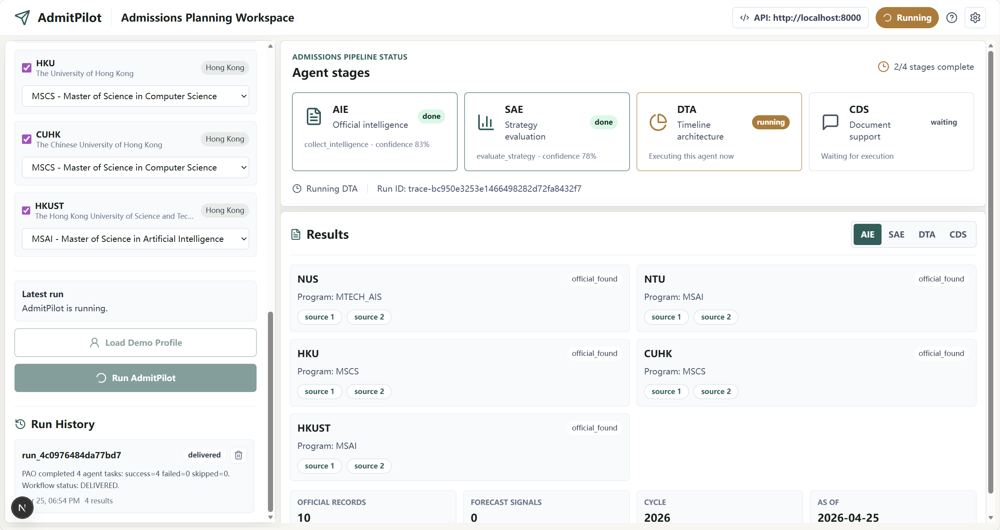
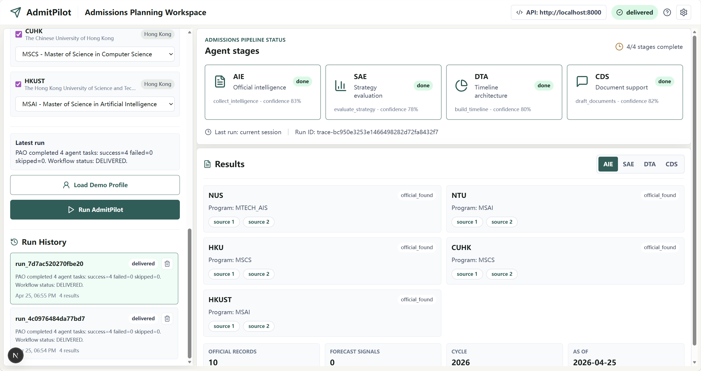

<p align="center">
  
</p>

<div align="center">
  <p>
    <a href="#zh-cn">中文</a> | <a href="./README_EN.md">English</a>
  </p>
  <p>
    
    
    
    
    
  </p>
  <p>
    
    
    
    
    
  </p>
</div>

<a id="zh-cn"></a>

## 中文

AdmitPilot 是一个面向研究生留学申请规划的多代理决策支持系统。系统由 `PAO`
统一调度 `AIE / SAE / DTA / CDS` 四类代理，当前聚焦 `NUS / NTU / HKU /
CUHK / HKUST` 五校、共 `38` 个泛计算机相关硕士项目，覆盖招生情报、选校策略、
申请时间线与文书支持四类核心任务。

当前仓库状态是“可演示原型”，不是生产应用。核心 CLI 流程与测试可运行，
`Phase 1-5` 的答辩演示链路已收口；Web MVP 已加入演示登录、WebSocket
阶段事件与 SQLite 运行历史持久化。全量实时官方页覆盖、异步任务与上线准备
仍未进入当前范围。

### 目录

- [项目亮点](#zh-highlights)
- [系统架构](#zh-architecture)
- [体验入口](#zh-entry)
- [项目配图](#zh-assets)
- [当前基线](#zh-baseline)
- [代码结构](#zh-structure)
- [文档约定](#zh-docs)
- [环境准备](#zh-setup)
- [运行方式](#zh-usage)
- [质量检查](#zh-quality)
- [PyCharm 说明](#zh-pycharm)

<a id="zh-highlights"></a>

### 项目亮点

- `多代理编排`：由 `PAO` 统一编排 `AIE / SAE / DTA / CDS` 四类代理
- `招生情报`：聚合院校项目要求、deadline、官网页面与案例库基线
- `选校支持`：基于规则与语义匹配进行选校分析、风险判断与解释生成
- `时间线规划`：支持 deadline 逆排、任务依赖、延期重排与冲突检测
- `文书支持`：输出结构化证据、fact slots、文书提纲与一致性检查结果
- `多入口体验`：支持 `CLI`、`FastAPI`、`Next.js Web MVP` 三种体验入口

<a id="zh-architecture"></a>

### 系统架构





当前默认支持范围：

- 学校：`NUS / NTU / HKU / CUHK / HKUST`
- 项目：`38` 个泛计算机相关硕士项目
- 数据基线：`official_library + case_library + program_rules`
- 接口形态：`CLI + API + Web MVP`

<a id="zh-entry"></a>

### 体验入口

```bash
# 命令行演示
$env:PYTHONPATH='src'
python -m admitpilot.main

# 后端 API
python run_backend.py

# 前端 Web MVP
cd frontend
npm run dev
```

Web 演示登录信息：

- 账号：`demo@admitpilot.local`
- 密码：`admitpilot-demo`

<a id="zh-assets"></a>

### 项目配图

当前 README 配套素材已落地到 `docs/assets/readme/`，可直接用于仓库首页展示、课程汇报与项目说明。

项目横幅：



Web 界面截图：

演示登录页，展示 demo 账号登录入口与运行记录持久化能力。



工作台主界面，包含申请信息表单、代理阶段面板与结果区。



阶段执行视图，展示 WebSocket 实时阶段事件与代理状态变化。



运行历史视图，展示 SQLite 持久化后的执行记录与恢复能力。



<a id="zh-baseline"></a>

### 当前基线

- 默认 LLM 提供方：OpenAI
- 默认模型：`gpt-5.4-nano`
- AIE 默认采用：`live-first` 官网抓取；字段缺失或校正失败时按字段回退到 `data/official_library/official_library.json`
- AIE 案例库默认读取：`data/case_library/case_library.json`
- AIE 会基于最终可信官网字段同步对应 `program_rules` 的 `hard_thresholds`
- SAE 默认语义匹配：`embedding`；测试与单测场景可使用：`fake`
- 官方库刷新入口：`python -m admitpilot.debug.refresh_official_library --cycle 2026`
- 默认演示项目组合（CLI `python -m admitpilot.main`）：
  - `NUS -> MCOMP_CS`
  - `NTU -> MSAI`
  - `HKU -> MSCS`
  - `CUHK -> MSCS`
  - `HKUST -> MSIT`
- 默认演示项目组合（Web `/api/v1/demo-profile`）：
  - `NUS -> MTECH_AIS`
  - `NTU -> MSAI`
  - `HKU -> MSCS`
  - `CUHK -> MSCS`
  - `HKUST -> MSAI`
- 最近验证命令（`2026-05-02`）：
  - `$env:PYTHONPATH='src'; pytest tests/test_aie_service.py tests/test_settings.py`：通过
  - `$env:PYTHONPATH='src'; pytest tests/test_aie_agent.py`：通过
- 推荐运行环境：`admitpilot` conda 环境
- 演示登录账号：`demo@admitpilot.local`
- 演示登录密码：`admitpilot-demo`
- 演示用 SQLite 数据库默认路径：`.admitpilot/admitpilot.sqlite3`

<a id="zh-structure"></a>

### 代码结构

- `src/admitpilot/core`：跨模块共享契约、上下文与 TypedDict 输出模型
- `src/admitpilot/pao`：编排层，请求契约、路由、执行图与结果聚合
- `src/admitpilot/agents`：AIE / SAE / DTA / CDS 业务代理；AIE 运行时包含 live-first 抓取、字段校正、官方库字段级回退与 `hard_thresholds` 同步
- `src/admitpilot/platform`：公共平台层，包括 memory、runtime、security、governance、observability
- `src/admitpilot/api`：FastAPI 入口与健康检查路由
- `src/admitpilot/config`：统一配置加载
- `tests`：回归测试
- `docs`：方案、实施计划与进度记录

<a id="zh-docs"></a>

### 文档约定

当前 `docs` 目录中的文档都应与代码基线保持一致。建议按以下角色理解：

- `docs/Project_Proposal_Group 26 (TANG Yutong, CHEN Jinghao, ZHANG Yufei, SHI Junren).docx`
  - 课程 proposal 与项目起点
- `docs/implementation_plan.md`
  - 从 demo 到真实应用的分步实施路线
- `docs/progress.md`
  - 实际落地进度与验证记录
- `docs/agent_engineering_architecture.md`
  - 当前代码基线的高层架构说明
- `docs/project_full_documentation.md`
  - 当前支持范围、实时支持矩阵与仓库状态快照

<a id="zh-setup"></a>

### 环境准备

```bash
conda activate admitpilot
python -m pip install -r requirements.txt
```

可选地在项目根目录创建 `.env`，参考 `.env.example`：

```env
OPENAI_API_KEY=your-key
OPENAI_MODEL=gpt-5.4-nano
OPENAI_EMBEDDING_MODEL=text-embedding-3-small
OPENAI_BASE_URL=https://api.openai.com/v1
OPENAI_TIMEOUT_SECONDS=30
ADMITPILOT_SEMANTIC_MATCHER_KIND=
ADMITPILOT_CASE_LIBRARY_PATH=data/case_library/case_library.json
```

<a id="zh-usage"></a>

### 运行方式

命令行演示：

```bash
$env:PYTHONPATH='src'
python -m admitpilot.main
```

后端 API：

```bash
python run_backend.py
```

前端工作台：

```bash
cd frontend
npm run dev
```

Web 演示流程：

1. 打开 `http://localhost:3000`。
2. 使用 `demo@admitpilot.local` / `admitpilot-demo` 登录。
3. 点击 `Load Demo Profile`。
4. 点击 `Run AdmitPilot`。
5. 前端通过 WebSocket `/api/v1/orchestrations/ws` 接收后端真实阶段事件；等待 `AIE / SAE / DTA / CDS` 依次进入 `running / completed`。
6. 在左侧 `Run History` 中点击任意历史记录，恢复该次 request 与 response。
7. 点击历史记录右侧删除按钮，可删除单条运行历史。

<a id="zh-quality"></a>

### 质量检查

当前已验证通过：

```bash
$env:PYTHONPATH='src'
python -m pytest -q
```

说明：

- `2026-04-25` 已验证 `pytest` / `ruff` / `mypy` 全量通过。
- 如需继续了解实现边界与后续推进路径，建议结合 `docs/progress.md` 与 `docs/implementation_plan.md` 阅读。

<a id="zh-pycharm"></a>

### PyCharm 说明

- Working Directory 指向项目根目录
- 将 `src` 标记为 Sources Root，或设置 `PYTHONPATH=src`
