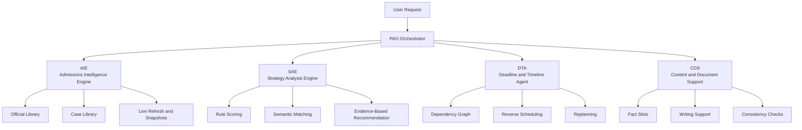

<h1 align="center">AdmitPilot</h1>

<div align="center">
  <p>
    <a href="./README.md">中文</a> | <a href="#en">English</a>
  </p>
  <p>
    
    
    
    
    
  </p>
  <p>
    
    
    
    
    
  </p>
</div>

<a id="en"></a>

## English

AdmitPilot is a multi-agent decision support system for graduate admissions
planning. A central `PAO` orchestrator coordinates `AIE / SAE / DTA / CDS`
across `NUS / NTU / HKU / CUHK / HKUST`, covering `38` computing-related
master's programs with support for admissions intelligence, school-fit
strategy, application timeline planning, and document assistance.

The repository is currently a demo-ready prototype rather than a production
system. The core CLI workflow and automated tests are runnable, the `Phase 1-5`
demo path is in place, and the Web MVP already includes demo login, WebSocket
stage events, and SQLite-backed run history. Full live coverage of official
program pages, async workers, and production readiness are still out of scope
for the current baseline.

### Contents

- [Highlights](#en-highlights)
- [Architecture](#en-architecture)
- [Entry Points](#en-entry)
- [Project Visuals](#en-assets)
- [Current Baseline](#en-baseline)
- [Code Structure](#en-structure)
- [Documentation Notes](#en-docs)
- [Setup](#en-setup)
- [Usage](#en-usage)
- [Quality Checks](#en-quality)
- [PyCharm Notes](#en-pycharm)

<a id="en-highlights"></a>

### Highlights

- `Multi-Agent Orchestration`: `PAO` coordinates `AIE / SAE / DTA / CDS`
- `Admissions Intelligence`: aggregates requirements, deadlines, official pages, and case-library baselines
- `Strategy Support`: combines rule scoring and semantic matching for fit analysis and rationale generation
- `Timeline Planning`: supports reverse scheduling, dependency management, replanning, and conflict checks
- `Document Support`: outputs structured evidence, fact slots, outlines, and consistency checks
- `Multiple Entry Points`: available through `CLI`, `FastAPI`, and `Next.js Web MVP`

<a id="en-architecture"></a>

### Architecture



Default support scope:

- Universities: `NUS / NTU / HKU / CUHK / HKUST`
- Programs: `38` computing-related master's programs
- Data baseline: `official_library + case_library + program_rules`
- Interfaces: `CLI + API + Web MVP`

<a id="en-entry"></a>

### Entry Points

```bash
# CLI
$env:PYTHONPATH='src'
python -m admitpilot.main

# Backend API
python run_backend.py

# Frontend Web MVP
cd frontend
npm run dev
```

Demo Web credentials:

- Account: `demo@admitpilot.local`
- Password: `admitpilot-demo`

<a id="en-assets"></a>

### Project Visuals

README visual assets are now available under `docs/assets/readme/` and can be
used directly for the repository landing page, course presentation, and project
documentation.

Core diagrams:


Web screenshots:

Demo login screen, highlighting the seeded account entry point and persisted run history experience.


Main workspace view, including the application form, agent stage panel, and results area.


Stage execution view, showing real-time WebSocket stage events and agent status transitions.


Run history view, showing SQLite-backed execution records and restore capability.


<a id="en-baseline"></a>

### Current Baseline

- Default LLM provider: OpenAI
- Default model: `gpt-5.4-nano`
- Default AIE official library: `data/official_library/official_library.json`
- Default AIE case library: `data/case_library/case_library.json`
- Test-mode AIE official-library shadow: `.pytest-local/runtime_official_library.test.json`
- Default SAE semantic matcher in non-test mode: `embedding`; in test mode: `fake`
- Official-library refresh entry point: `python -m admitpilot.debug.refresh_official_library --cycle 2026`
- Default demo portfolio for CLI `python -m admitpilot.main`:
  - `NUS -> MCOMP_CS`
  - `NTU -> MSAI`
  - `HKU -> MSCS`
  - `CUHK -> MSCS`
  - `HKUST -> MSIT`
- Default demo portfolio for Web `/api/v1/demo-profile`:
  - `NUS -> MTECH_AIS`
  - `NTU -> MSAI`
  - `HKU -> MSCS`
  - `CUHK -> MSCS`
  - `HKUST -> MSAI`
- Recently verified commands on `2026-04-25`:
  - `python -m pytest -q`: passed
  - `python -m ruff check src tests`: passed
  - `python -m mypy src tests`: passed
- Recommended runtime environment: `admitpilot` conda environment
- Demo account: `demo@admitpilot.local`
- Demo password: `admitpilot-demo`
- Default demo SQLite path: `.admitpilot/admitpilot.sqlite3`

<a id="en-structure"></a>

### Code Structure

- `src/admitpilot/core`: shared contracts, context, and TypedDict output models
- `src/admitpilot/pao`: orchestration layer, request contracts, routing, execution graph, and aggregation
- `src/admitpilot/agents`: business agents for `AIE / SAE / DTA / CDS`
- `src/admitpilot/platform`: platform layer for memory, runtime, security, governance, and observability
- `src/admitpilot/api`: FastAPI entry point and health-check routes
- `src/admitpilot/config`: centralized configuration loading
- `tests`: regression tests
- `docs`: proposals, implementation plans, and progress records

<a id="en-docs"></a>

### Documentation Notes

Files under `docs` should stay aligned with the current code baseline. Use the
following reading order:

- `docs/Project_Proposal_Group 26 (TANG Yutong, CHEN Jinghao, ZHANG Yufei, SHI Junren).docx`
  - course proposal and project origin
- `docs/implementation_plan.md`
  - step-by-step path from demo to a more realistic application
- `docs/progress.md`
  - actual implementation progress and verification record
- `docs/agent_engineering_architecture.md`
  - high-level architecture of the current code baseline
- `docs/project_full_documentation.md`
  - support scope, live-support matrix, and repository snapshot

<a id="en-setup"></a>

### Setup

```bash
conda activate admitpilot
python -m pip install -r requirements.txt
```

Optionally create a `.env` file at the project root based on `.env.example`:

```env
OPENAI_API_KEY=your-key
OPENAI_MODEL=gpt-5.4-nano
OPENAI_EMBEDDING_MODEL=text-embedding-3-small
OPENAI_BASE_URL=https://api.openai.com/v1
OPENAI_TIMEOUT_SECONDS=30
ADMITPILOT_SEMANTIC_MATCHER_KIND=
ADMITPILOT_CASE_LIBRARY_PATH=data/case_library/case_library.json
```

<a id="en-usage"></a>

### Usage

CLI demo:

```bash
$env:PYTHONPATH='src'
python -m admitpilot.main
```

API:

```bash
python run_backend.py
```

Frontend workspace:

```bash
cd frontend
npm run dev
```

Web demo flow:

1. Open `http://localhost:3000`.
2. Sign in with `demo@admitpilot.local` / `admitpilot-demo`.
3. Click `Load Demo Profile`.
4. Click `Run AdmitPilot`.
5. The frontend receives real stage events from `/api/v1/orchestrations/ws`; wait for `AIE / SAE / DTA / CDS` to move through `running / completed`.
6. Click any item in `Run History` on the left to restore that request and response.
7. Use the delete button beside a history item to remove that record.

<a id="en-quality"></a>

### Quality Checks

Currently verified:

```bash
$env:PYTHONPATH='src'
python -m pytest -q
```

Notes:

- Full `pytest` / `ruff` / `mypy` validation passed on `2026-04-25`.
- For implementation boundaries and next-step planning, also see `docs/progress.md` and `docs/implementation_plan.md`.

<a id="en-pycharm"></a>

### PyCharm Notes

- Set the Working Directory to the project root
- Mark `src` as a Sources Root, or set `PYTHONPATH=src`
- Run `admitpilot.main` or `admitpilot.api.main` directly as modules
