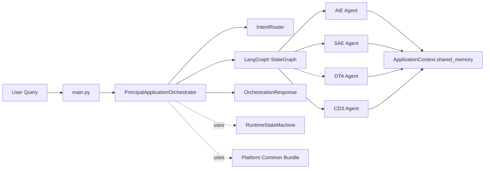
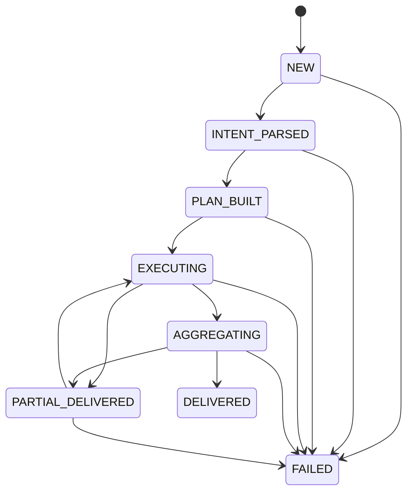

# AdmitPilot 项目完整技术文档（流程与模块设计）

- 文档版本：`v1.0`
- 文档日期：`2026-04-06`
- 适用代码基线：`src/admitpilot`（当前仓库实现）

## 1. 项目概述

AdmitPilot 是一个面向留学申请场景的多代理编排系统。系统通过 `PAO`（Principal Application Orchestrator）统一调度四类业务代理：

- `AIE`（Admissions Intelligence Engine）：招生情报采集与置信度建模。
- `SAE`（Strategic Admissions Evaluator）：选校匹配与风险排序。
- `DTA`（Dynamic Timeline Architect）：时间线排期与周计划生成。
- `CDS`（Core Document Specialist）：文书与面试支持包生成。

当前默认目标院校范围为：`NUS / NTU / HKU / CUHK / HKUST`，默认目标项目为 `MSCS`。

## 2. 目录与模块映射

| 路径 | 模块角色 | 设计定位 |
| --- | --- | --- |
| `src/admitpilot/main.py` | 入口层 | 构造请求并触发一次端到端编排示例 |
| `src/admitpilot/core` | 核心模型层 | 定义跨模块共享上下文与代理输出契约 |
| `src/admitpilot/pao` | 控制与编排层 | 意图路由、任务计划、状态图执行、结果聚合 |
| `src/admitpilot/agents` | 业务执行层 | AIE/SAE/DTA/CDS 四类代理实现 |
| `src/admitpilot/platform` | 平台公共层 | MCP、工具目录、记忆、治理、安全、可观测等骨架 |
| `tests` | 质量保障层 | 编排流程、平台契约、缓存与权限校验测试 |
| `docs/agent_engineering_architecture.md` | 架构规划文档 | 分工与目标能力路线（偏规划） |

## 3. 总体架构设计

### 3.1 分层架构

1. **Control Plane（PAO）**  
负责用户请求解析、任务路由、依赖门控、执行编排与统一聚合。
2. **Agent Runtime Plane（AIE/SAE/DTA/CDS）**  
负责业务计算与结构化结果输出。
3. **Tool & MCP Plane（platform.mcp + platform.tools）**  
提供方法目录、Schema 注册、服务存根与工具权限映射。
4. **Memory Plane（platform.memory）**  
提供会话存储、版本化记录与大文本对象存储接口。
5. **Governance/Security/Observability Plane**  
提供 ACL、PII 脱敏、审计、审批、能力令牌、trace/metrics 骨架。

### 3.2 高层组件关系图



## 4. 端到端流程设计

## 4.1 主流程（invoke）

`PrincipalApplicationOrchestrator.invoke()` 的标准执行路径：

1. 构建 `ApplicationContext`（用户问题、画像、约束、共享内存）。
2. 初始化 `PaoGraphState`，初始状态为 `WorkflowStatus.NEW`。
3. 执行 LangGraph：`intake -> route -> dispatch* -> aggregate`。
4. 输出 `OrchestrationResponse`（`summary + results + context`）。

### 4.2 Graph 节点设计

| 节点 | 输入 | 关键动作 | 输出 |
| --- | --- | --- | --- |
| `intake` | 初始图状态 | 状态迁移 `NEW -> INTENT_PARSED` | 更新 `workflow_status` |
| `route` | query | `IntentRouter.build_plan` 构造 `RoutePlan` | 写入 `route_plan/pending_tasks`，状态迁移到 `PLAN_BUILT` |
| `dispatch` | pending_tasks | 取队首任务，检查依赖，执行对应 agent，写回共享内存 | 追加 `AgentResult`，消费一个任务 |
| `aggregate` | results | 统计 success/failed/skipped，组装摘要 | 状态迁移到 `DELIVERED` 或 `PARTIAL_DELIVERED` |

### 4.3 执行状态机

`platform.runtime.state_machine` 定义允许迁移：



### 4.4 路由规则与任务图

`IntentRouter` 基于关键词匹配四类意图：

- `intelligence`：信息、政策、官网、deadline、要求、更新
- `strategy`：选校、匹配、定位、风险、reach/match/safety
- `timeline`：时间线、计划、排期、milestone、任务
- `documents`：文书、ps、sop、cv、面试、叙事

若未命中任何关键词，默认全量意图（四类全开）。

任务编排规则（顺序执行）：

1. 固定加入 `collect_intelligence`（agent=`aie`）。
2. 命中 `strategy` 时加入 `evaluate_strategy`，依赖 `collect_intelligence`，要求共享内存 `aie`。
3. 命中 `timeline` 时加入 `build_timeline`，依赖 `evaluate_strategy`，要求共享内存 `aie + sae`。
4. 命中 `documents` 时加入 `draft_documents`，依赖 `evaluate_strategy + build_timeline`，要求共享内存 `sae + dta`，并设置 `can_degrade=True`。

### 4.5 依赖门控、降级与异常

`_resolve_blockers` 会检查两类阻塞项：

- 任务依赖缺失或失败：`missing_task:*` / `failed_task:*`
- 共享内存缺失：`missing_memory:*`

处理策略：

- 若存在阻塞且 `can_degrade=False`：任务标记 `SKIPPED`，错误为 `dependency_blocked`。
- 若存在阻塞且 `can_degrade=True`：记录 `context.decisions["degraded_tasks"]`，仍执行 agent（降级模式）。
- 若 agent 未注册：任务 `FAILED`，错误 `agent_not_registered`。
- 若 agent 抛异常：任务 `FAILED`，错误 `agent_execution_error`，并带 traceback。

最终聚合策略：

- 若 `failed_count==0` 且 `skipped_count==0` -> `DELIVERED`
- 否则 -> `PARTIAL_DELIVERED`

## 5. 核心数据模型设计

## 5.1 运行时契约（runtime.contracts）

- `TaskStatus`：`PENDING/READY/RUNNING/SUCCESS/FAILED/SKIPPED/DEGRADED`
- `WorkflowStatus`：`NEW/INTENT_PARSED/PLAN_BUILT/EXECUTING/AGGREGATING/DELIVERED/PARTIAL_DELIVERED/FAILED`
- `AgentTask`：任务定义，包含依赖、内存要求、重试策略、预算、降级开关。
- `AgentResult`：任务输出，包含 `status/output/confidence/trace/blocked_by/error_code...`。

## 5.2 上下文模型（core.schemas）

- `UserProfile`：申请者画像（地区、学校、专业兴趣、成绩、经历等）。
- `ApplicationContext`：PAO 共享上下文，含 `constraints/shared_memory/decisions`。
- `SharedMemory`：分区结构，键包含 `aie/sae/dta/cds`。

## 5.3 代理输出契约（TypedDict）

- `AIEAgentOutput`：官方/案例记录、预测信号、证据等级、缓存命中等。
- `SAEAgentOutput`：模型分解、优劣势、gap actions、推荐排序。
- `DTAAgentOutput`：执行板标题、里程碑、周计划、风险标记、文书指令。
- `CDSAgentOutput`：文书草稿、面试要点、一致性问题、审校清单。

## 6. 模块详细设计

## 6.1 PAO（`src/admitpilot/pao`）

### 组件

- `contracts.py`：`OrchestrationRequest/OrchestrationResponse`
- `router.py`：`IntentRouter` 负责 query -> RoutePlan
- `schemas.py`：`RoutePlan/PaoGraphState`
- `orchestrator.py`：`PrincipalApplicationOrchestrator` 核心执行器

### 设计要点

- 采用 `LangGraph StateGraph`，显式建模 `START/END` 与分支决策。
- 执行前对上下文做深拷贝，避免图状态原地污染。
- 结果统一落在 `AgentResult`，便于聚合与审计。
- 共享内存只回写 `SUCCESS` 结果，避免错误输出污染下游。

## 6.2 AIE（`src/admitpilot/agents/aie`）

### 目标

构建结构化招生情报包，融合官方信息、案例信息与预测信号。

### 关键组件

- `service.py`：检索与快照核心逻辑
- `gateways.py`：外部源接口与 stub 实现
- `repositories.py`：官方/案例快照缓存仓储
- `schemas.py`：记录模型
- `agent.py`：Agent 层输出映射

### 主算法流程

1. 归一化学校范围（只保留支持学校，否则回退默认五校）。
2. 对每个学校解析当前季官方快照：
   - 命中缓存直接复用。
   - 已发布：抓取记录，计算均值置信度，TTL 24 小时。
   - 未发布：用历史记录构建预测快照，TTL 7 天。
3. 拉取案例记录并生成案例统计快照（TTL 3 天）。
4. 产出 `AdmissionsIntelligencePack`，包含状态映射与预测信号。

### 关键公式

- 预测快照置信度：`0.5*history_conf + 0.3*stability + 0.2*signal_strength`
- 历史置信衰减：`max(0.72, 0.9 * exp(-0.03 * offset))`

### 当前数据源实现

- `StubOfficialSourceGateway`：模拟官网发布判断与页面记录生成。
- `StubCaseSourceGateway`：模拟多来源案例（agency/forum/xiaohongshu）并生成置信度。
- 仓储默认内存实现，支持按 `expires_at` 过期。

## 6.3 SAE（`src/admitpilot/agents/sae`）

### 目标

将 AIE 情报与用户画像转化为可执行选校策略。

### 评分模型

- 权重：`rule=0.45`, `semantic=0.35`, `risk=0.20`
- 总分：`overall = 0.45*rule + 0.35*semantic + 0.20*(1-risk)`

### 分层规则

- `overall >= 0.72` -> `match`
- `0.60 <= overall < 0.72` -> `reach`
- `< 0.60` -> `safety`

### 输出

- 推荐列表（按 overall 降序）
- 排序顺序 `ranking_order`
- 优势、短板与 gap actions
- 官方未完整发布学校统计（用于风险提示）

## 6.4 DTA（`src/admitpilot/agents/dta`）

### 目标

根据策略结果输出可执行的周级申请计划。

### 计划生成逻辑

1. 生成里程碑图（`scope_lock -> doc_pack_v1 -> submission_batch_1 -> interview_prep`）。
2. 学校数 >=4 时自动加入缓冲里程碑 `buffer_window`。
3. 根据 `constraints.has_delay` 做统一周次顺延。
4. 生成 `timeline_weeks` 周计划（默认 8 周，边界 4~16）。
5. 生成风险标记（信息未发布、提交窗口拥堵等）。
6. 输出文书执行指令（版本矩阵、事实槽位更新、面试前置准备）。

### 风险设计

- 若存在非 `official_found` 学校：第 2 周添加黄色告警，建议每周同步官网更新。
- 在 `submission_batch_1` 周添加红色告警：提前 5-7 天完成提交。

## 6.5 CDS（`src/admitpilot/agents/cds`）

### 目标

生成文书草稿框架、面试线索与一致性审校建议。

### 输出生成逻辑

1. 基于策略推荐学校构建学校范围（无输入时回退默认五校）。
2. 构建事实槽位（动机、项目匹配、执行证明）。
3. 为每校生成 `sop v0` 草稿，并额外生成一份共享 `cv v0`。
4. 基于首选学校与周计划生成面试 cue。
5. 执行一致性检查并输出审校 checklist。

### 一致性策略（当前骨架）

- 若缺少核心文档（SoP/CV） -> 高严重度问题。
- 若存在未核验事实槽位 -> 中严重度问题。

## 6.6 Platform Common（`src/admitpilot/platform/bootstrap.py`）

`PlatformCommonBundle` 一次性汇总：

- `method_schemas`
- `mcp_servers`
- `tool_registry`
- `memory_adapters`
- `governance`
- `observability`
- `error_codes`

该 bundle 用作平台能力统一注入点。

## 6.7 MCP 设计（`platform/mcp`）

### 协议层

- `RpcMeta` 强制携带：`trace_id/tool_run_id/tenant/user/application/cycle`。
- `MCPRequest/MCPResponse` 采用 JSON-RPC 风格封装。
- `MCPResult` 包含 `confidence/evidence_level/result_version/lineage`。

### 目录与注册

- `METHOD_CATALOG` 当前定义 10 个方法（intelligence/knowledge/strategy/timeline/document/governance）。
- `MethodSchemaRegistry` 提供方法必填字段校验。
- `MCPServerRegistry` 按 server 自动聚合方法存根。

## 6.8 Tool Registry（`platform/tools/registry.py`）

### 分层

- `L0_GOVERNANCE`
- `L1_ACQUISITION`
- `L2_RETRIEVAL`
- `L3_REASONING`
- `L4_GENERATION`

### 当前默认工具

- `policy_validate`（pao）
- `official_fetch`（aie）
- `hybrid_retrieve`（aie/sae/dta/cds）
- `risk_rank`（sae）
- `timeline_plan_build`（dta）
- `draft_compose`（cds）

### 关键约束

- 注册时校验 `tool.method` 是否存在于 `METHOD_CATALOG`。
- 校验 `tool.server` 与 method 所属 server 一致，避免目录漂移。

## 6.9 Memory 设计（`platform/memory`）

### 协议

- `SessionMemoryStore`：会话态（建议 Redis）
- `VersionedMemoryStore`：版本化结构化记录（建议 PostgreSQL）
- `ArtifactObjectStore`：大文本对象（建议 S3/MinIO）

### 默认拓扑建议

- session: `redis`
- relational: `postgresql`
- vector: `pgvector_or_milvus`
- object: `s3_or_minio`
- audit: `clickhouse_or_elk`

### 本地适配器

- `InMemorySessionMemoryStore`：TTL 过期控制
- `InMemoryVersionedMemoryStore`：按 namespace+tenant+user+application+cycle 维护 latest 索引
- `InMemoryArtifactObjectStore`：文本对象字典存储

## 6.10 Governance 设计（`platform/governance`）

### 能力

- Namespace ACL（读写隔离）
- PII 脱敏
- 审计事件
- 审批工作流

### 默认 ACL 矩阵

| Agent | 读权限（namespace） | 写权限（namespace） |
| --- | --- | --- |
| pao | application, official, case, strategy, timeline, artifact, audit | application, audit |
| aie | application, official, case | official, case |
| sae | application, official, case, strategy | strategy |
| dta | application, official, strategy, timeline | timeline |
| cds | application, strategy, timeline, artifact | artifact |

## 6.11 Runtime 设计（`platform/runtime`）

- 统一状态枚举、任务契约、预算、重试策略。
- `RuntimeStateMachine` 负责迁移合法性校验。
- `AgentRuntimeProtocol` 预留统一运行时执行接口。

## 6.12 Security 设计（`platform/security/capability.py`）

- `CapabilityToken` 定义方法级与 scope 级权限。
- `InMemoryCapabilityValidator` 校验 token 过期、method、scope。
- 当前尚未与 PAO 调度链路强绑定，属于可接入骨架。

## 6.13 Observability 设计（`platform/observability`）

- `TraceRecord/MetricPoint` 标准数据结构。
- `InMemoryTraceSink/InMemoryMetricSink` 提供本地写入与查询。
- 后续可替换 OpenTelemetry/Prometheus 实现。

## 6.14 错误码设计（`platform/common/errors.py`）

统一错误码分层：

- `AUTH_*`：鉴权类
- `REQ_*`：请求校验类
- `DATA_*`：数据一致性类
- `SYS_*`：系统依赖类

并通过 `ErrorDescriptor` 维护 `category/retryable/default_message`。

## 7. 测试设计与覆盖

## 7.1 编排层测试（`tests/test_orchestrator.py`）

覆盖以下场景：

- 正常路径可完成多任务编排。
- 未注册代理时返回 `agent_not_registered`。
- 依赖缺失时任务被 `SKIPPED` 且携带 `blocked_by`。
- 可降级任务在依赖不足时仍执行并记录 `degraded_tasks`。

## 7.2 AIE 服务测试（`tests/test_aie_service.py`）

覆盖以下场景：

- 同日重复请求命中缓存。
- 官方+预测混合快照输出。
- 学校范围约束与回退机制。

## 7.3 平台契约测试

- `tests/test_platform_common_bootstrap.py`：Schema 校验、MCP server 注册、memory adapter、governance、bundle 初始化。
- `tests/test_platform_interfaces.py`：方法目录关键项、tool 权限、状态机迁移、capability 校验、memory topology 默认值。

## 8. 运行与开发说明

## 8.1 环境要求

- Python `3.11+`

## 8.2 安装与执行

```bash
python -m pip install -r requirements.txt
$env:PYTHONPATH='src'; python -m admitpilot.main
```

## 8.3 质量检查

```bash
$env:PYTHONPATH='src'; python -m ruff check .
$env:PYTHONPATH='src'; python -m mypy
$env:PYTHONPATH='src'; python -m pytest
```

## 9. 当前实现边界与已知约束

1. `platform` 多数为初始化骨架，尚未接入真实生产后端（Redis/PostgreSQL/S3/OTel 等）。
2. AIE 外部源仍为 stub，尚未接入真实官网抓取、解析、反爬与频控。
3. Capability token 尚未接入调度前置拦截链路。
4. 文书一致性检查仍是规则占位，未接入事实图谱或实体对齐。
5. 路由层中 `timeline/documents` 任务依赖 `evaluate_strategy`，若 query 仅命中时间线或文书关键词，可能触发跳过或降级执行（取决于 `can_degrade`）。

## 10. 推荐落地路线（从骨架到生产）

1. **打通真实数据链路**：先落 AIE 官方抓取+解析+快照 diff。
2. **实现策略与排期核心算法**：接入 SAE 规则 DSL、DTA DAG 调度与重排。
3. **接入平台生产后端**：memory/governance/observability 全量替换并接审计告警。
4. **建立可回放链路**：按 `trace_id + lineage + version_id` 完整重放单申请流程。
5. **完善安全门控**：把 capability/token、policy_validate、tool registry 串成统一前置闸门。

